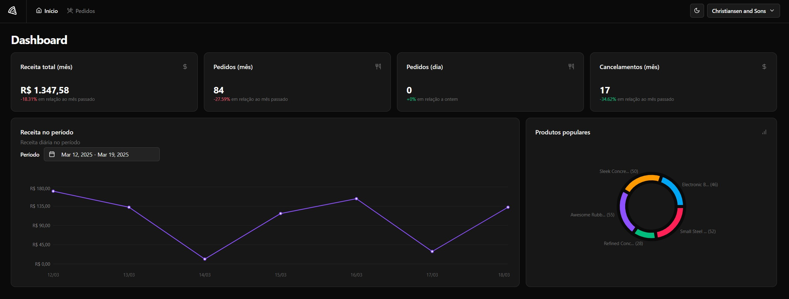
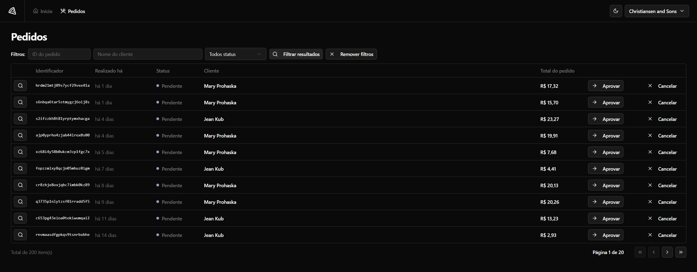
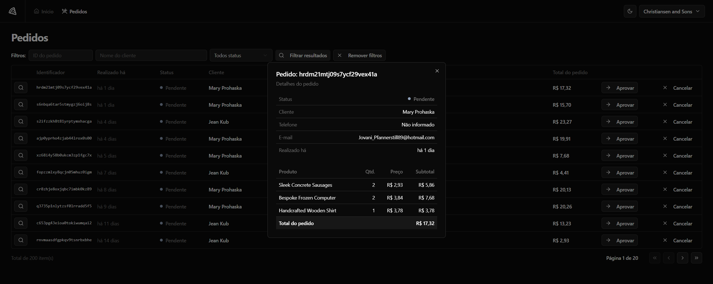

<h1 align="center">Pizza Shop</h1>

Programa desenvolvido pela Rockekseat, promovido para ensinar integração do backend com o frontend realizado em React. 

  <a href="#-tecnologias">Tecnologias</a>&nbsp;&nbsp;&nbsp;|&nbsp;&nbsp;&nbsp;
  <a href="#-projeto">Projeto</a>&nbsp;&nbsp;&nbsp;|&nbsp;&nbsp;&nbsp;
  <a href="#memo-licença">Licença</a>

  

 

  

  

  

## 🚀 Tecnologias

Esse projeto foi desenvolvido com as seguintes tecnologias:

- Tailwind
- TypeScript
- React
- Git e Github

## 💻 Projeto

O Pizza Shop é uma aplicação de gerenciamento para um lojista de restaurante que possui uma página de dashbord e outra com informações dos pedidos

## :memo: Licença

Esse projeto está sob a licença MIT.

---

Feito com ♥ by Rocketseat :wave: [Participe da nossa comunidade!](https://discord.gg/rocketseat)